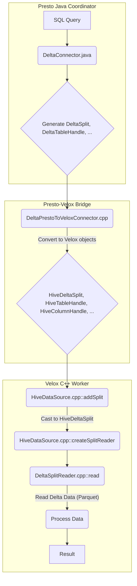

# Delta Connector Implementation in Prestissimo (C++ Worker)

This document describes the implementation of the Delta connector within the Prestissimo C++ worker, focusing on the query execution flow (read path). The goal is to enable Prestissimo to process queries against Delta Lake tables by translating Presto's Java-side Delta objects into Velox C++ equivalents and integrating them into the Velox Hive connector framework.

## 1. Core Components

The Delta connector implementation in Velox (`velox/velox/connectors/hive/delta/`) introduces several key components:

*   ### `DeltaConnector.h/.cpp`
    This class serves as the main entry point for the Delta connector on the Velox side. It inherits from `HiveConnector` and is responsible for creating data sources and sinks (though data sinks are not yet fully implemented for Delta). It registers Iceberg-like internal functions for partition transforms.

*   ### `HiveDeltaSplit.h/.cpp`
    This struct extends `velox::connector::hive::HiveConnectorSplit` and encapsulates Delta-specific information required for processing a split. It carries details such as file size and node selection strategy, which are crucial for efficient data retrieval. The `HiveDeltaSplit.cpp` ensures that this new split type is properly registered for serialization and deserialization.

*   ### `DeltaSplitReader.h/.cpp`
    This class inherits from `velox::connector::hive::SplitReader` and is responsible for reading data from individual Delta file splits. Currently, its implementation is a placeholder that assumes Parquet file format. Future work would involve dynamically dispatching to appropriate readers (e.g., ORC, Parquet) based on the actual file format of the Delta table.

## 2. Presto Protocol Integration

Communication between the Presto Java coordinator and the Prestissimo C++ worker relies on a defined protocol. The `presto_cpp/presto_protocol/connector/delta/` directory houses these definitions:

*   ### `presto_protocol_delta.h/.cpp`
    These files contain the C++ representations of Java-side Delta protocol objects (e.g., `DeltaTableHandle`, `DeltaColumnHandle`, `DeltaSplit`). These are automatically generated from `presto_protocol_delta.yml` and Java source files, ensuring consistency between the coordinator and worker.

*   ### `DeltaPrestoToVeloxConnector.h/.cpp`
    This component acts as a bridge, converting the Presto Java protocol objects into their corresponding Velox C++ types.
    *   `toVeloxSplit()`: Translates `protocol::delta::DeltaSplit` into `velox::connector::hive::delta::HiveDeltaSplit`, populating all necessary fields.
    *   `toVeloxColumnHandle()`: Converts `protocol::delta::DeltaColumnHandle` into `velox::connector::hive::HiveColumnHandle`.
    *   `toVeloxTableHandle()`: Transforms `protocol::delta::DeltaTableLayoutHandle` and `protocol::delta::DeltaTableHandle` into `velox::connector::hive::HiveTableHandle`.
    *   The `createConnectorProtocol()` method returns a `protocol::delta::DeltaConnectorProtocol` instance, ensuring the correct protocol is used for Delta-specific communication.

## 3. Velox Hive Integration

To integrate the Delta connector into the existing Velox Hive framework, modifications were made to generic Hive components:

*   ### `velox/velox/connectors/hive/HiveConnector.h/.cpp`
    The `HiveConnector` now includes a templated `registerSerDe()` method in its header, allowing various `HiveConnectorSplit` subclasses (like `HiveDeltaSplit`) to register their serialization/deserialization logic. In `HiveConnector.cpp`, a call to `registerSerDe<delta::HiveDeltaSplit>()` ensures that Delta splits can be correctly handled.

*   ### `velox/velox/connectors/hive/HiveDataSource.cpp`
    The `createSplitReader()` method within `HiveDataSource` has been modified. It now includes logic to dynamically cast incoming splits. If a `velox::connector::hive::delta::HiveDeltaSplit` is detected, it instantiates a `DeltaSplitReader` to process the data, overriding the generic `SplitReader` behavior.

## 4. Query Flow Diagram

## 5. Next Steps / Future Work

*   **Robust `DeltaSplitReader`**: The current `DeltaSplitReader`'s `read` method is a placeholder. It needs to be fully implemented to correctly read data from various Delta Lake file formats (Parquet, ORC, etc.), handling schema evolution and other Delta-specific features.
*   **File Format Dispatching**: The `DeltaPrestoToVeloxConnector::toVeloxSplit` currently hardcodes the file format to Parquet. A more robust solution would dynamically determine the actual file format from Delta metadata and pass this information to the `DeltaSplitReader`.
*   **Write Path (`DeltaDataSink`)**: The implementation currently focuses solely on the read path. A complete Delta connector would require implementing `DeltaDataSink` for write operations (INSERT, UPDATE, DELETE).
*   **Predicate Pushdown**: Enhance the `toVeloxTableHandle` to translate more complex predicates for pushdown to the Delta engine, improving query performance.

This initial implementation lays the groundwork for a fully functional Delta connector within the Prestissimo C++ worker.
