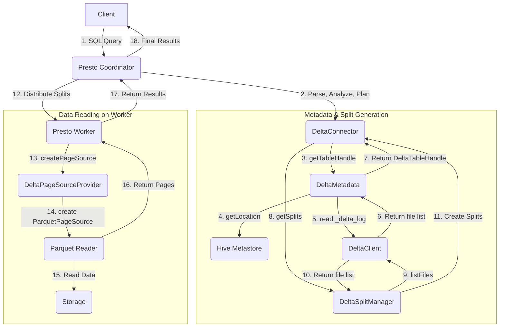

# Presto Delta Lake Connector Query Flow

This document describes the code flow of how Presto handles a query with the Delta Lake connector.

## Overview

The Presto Delta Lake connector allows Presto to query data stored in Delta Lake format. The query execution involves several key components that work together to parse the query, read the Delta Lake transaction log, identify the relevant data files, and then read the data from those files.

The main components involved are:

-   **`DeltaConnector`**: The main entry point for the connector. It provides the metadata, split manager, and page source provider.
-   **`DeltaMetadata`**: Handles all metadata-related operations, such as retrieving table information, schema, and column handles. It interacts with the Hive Metastore to get the table's location and then uses the `DeltaClient` to read the Delta Lake transaction log.
-   **`DeltaSplitManager`**: Responsible for generating splits, which are logical chunks of data that can be processed in parallel. It reads the Delta Lake transaction log to get the list of data files and creates a split for each relevant file.
-   **`DeltaPageSourceProvider`**: Creates a `ConnectorPageSource` that reads the actual data from the data files (in Parquet format) for a given split.
-   **`DeltaPlanOptimizerProvider`**: Provides rules to optimize the query plan. For the Delta connector, this includes a rule to push down dereference expressions into the Parquet reader, which can improve performance by reading only the required nested data.

## Mermaid Flowchart

## Detailed Code Flow

1.  **Query Submission & Parsing**: A user submits a SQL query to the Presto coordinator. The query is parsed, analyzed, and a logical plan is created.

2.  **Optimization**: The logical plan is optimized. The `DeltaPlanOptimizerProvider` provides the `DeltaParquetDereferencePushDown` rule, which pushes down expressions that access nested fields into the Parquet reader. This avoids reading unnecessary data from nested columns.

3.  **`DeltaConnector`**: The Presto planner interacts with the `DeltaConnector` to get information about the table.

4.  **`DeltaMetadata.getTableHandle`**:
    *   The connector calls `DeltaMetadata.getTableHandle()` to get a handle for the table.
    *   `DeltaMetadata` first contacts the **Hive Metastore** to get the location of the Delta Lake table.
    *   It then uses the `DeltaClient` to read the `_delta_log` directory for the table at the specified location.
    *   The `DeltaClient` processes the transaction log to determine the current version of the table and the list of active data files.
    *   `DeltaMetadata` uses this information to create a `DeltaTableHandle`, which contains the schema and other table properties.

5.  **`DeltaSplitManager.getSplits`**:
    *   The planner then calls `DeltaSplitManager.getSplits()` to get the splits for the query.
    *   `DeltaSplitManager` uses the `DeltaClient` to get the list of data files (which are in Parquet format) that constitute the table's data.
    *   It applies partition pruning based on the query's `WHERE` clause to filter out files that are not relevant to the query.
    *   For each relevant data file, it creates a `DeltaSplit`, which contains the file path, offset, and length.

6.  **Task Execution on Workers**:
    *   The Presto coordinator sends the splits to the Presto workers for execution.
    *   On each worker, a task is created to process a split.

7.  **`DeltaPageSourceProvider.createPageSource`**:
    *   The worker calls `DeltaPageSourceProvider.createPageSource()` for the given split.
    *   This provider is responsible for creating a `ConnectorPageSource` that can read the data from the split.
    *   Since Delta Lake tables store data in Parquet format, the `DeltaPageSourceProvider` creates a `ParquetPageSource`.
    *   The `ParquetPageSource` uses a `ParquetReader` to read the data from the Parquet file specified in the `DeltaSplit`.
    *   The `DeltaPageSource` wraps the `ParquetPageSource` and also handles adding the partition column values to the result, as these are not stored in the data files themselves.

8.  **Data Reading & Return**:
    *   The `ParquetReader` reads the data from the Parquet file, applying any pushed-down predicates to filter rows.
    *   The data is returned to the Presto worker as a stream of pages.
    *   The worker processes the pages, and the final results are sent back to the coordinator, which then returns them to the user.
