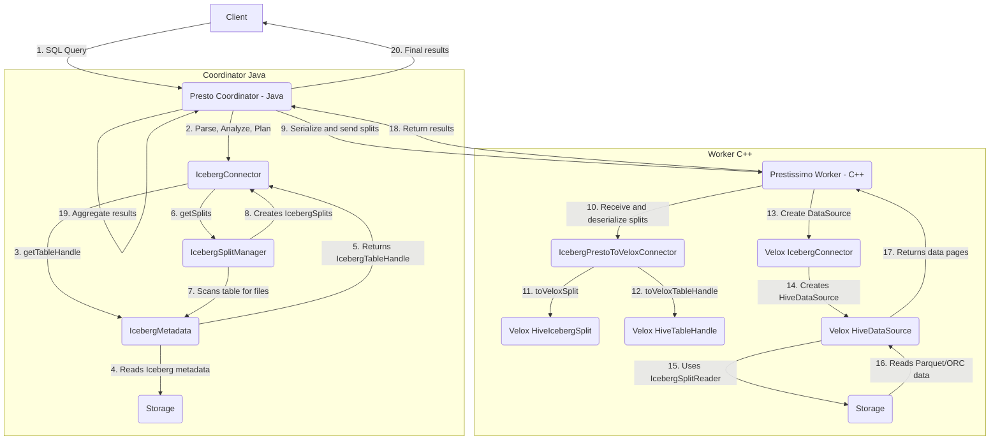

# Presto Iceberg Connector with Prestissimo Worker Query Flow

This document describes the code flow of how Presto handles a query with the Iceberg connector, specifically in a distributed setup with a Java-based coordinator and C++-based Prestissimo workers (which use the Velox engine).

## Overview

Querying Iceberg tables in a Presto environment with Prestissimo workers involves a collaboration between the Java components (coordinator) and the C++ components (worker). The Java coordinator is responsible for planning the query and generating splits, while the C++ worker is responsible for executing the query on the data.

The main components involved are:

### Java (Coordinator)
-   **`IcebergConnector`**: The main entry point for the connector on the Java side.
-   **`IcebergMetadata`**: Handles metadata operations, reading the Iceberg table's metadata files.
-   **`IcebergSplitManager`**: Generates splits from the Iceberg table's data files.

### C++ (Prestissimo Worker)
-   **`IcebergPrestoToVeloxConnector`**: A bridge component that translates the Presto Java objects (received from the coordinator) into Velox C++ objects.
-   **`IcebergConnector` (in Velox)**: The C++ connector that handles Iceberg-specific logic within the Velox execution engine. It's a subclass of the `HiveConnector` and leverages its capabilities.
-   **`HiveIcebergSplit`**: The Velox representation of an Iceberg split.
-   **`IcebergSplitReader`**: A component within Velox's `HiveDataSource` that knows how to read data from Iceberg tables, including handling delete files.

## Mermaid Flowchart

## Detailed Code Flow

1.  **Query Submission & Planning (Java Coordinator)**:
    *   A user submits a SQL query to the Presto coordinator.
    *   The coordinator parses, analyzes, and plans the query, interacting with the `IcebergConnector`.
    *   `IcebergMetadata` is used to read the Iceberg table's metadata from storage (e.g., the metadata JSON files and manifest lists). This provides the schema, partition information, and snapshot details.
    *   `IcebergSplitManager` is called to generate the splits. It scans the table's manifest files to get a list of data files. It performs partition pruning based on the query's `WHERE` clause.
    *   For each relevant data file, an `IcebergSplit` is created. This split contains the path to the data file, the file format, and information about any associated delete files.

2.  **Split Serialization and Distribution**:
    *   The Presto coordinator serializes the `IcebergSplit` objects and the query plan. The serialization format is defined by the `IcebergConnectorProtocol`.
    *   The serialized plan and splits are sent to the Prestissimo workers.

3.  **Execution on Prestissimo Worker (C++)**:
    *   The Prestissimo worker receives the serialized plan and splits.
    *   The `IcebergPrestoToVeloxConnector` is responsible for deserializing these objects and converting them into their Velox C++ equivalents.
        *   `toVeloxSplit()` converts the `protocol::iceberg::IcebergSplit` into a `velox::connector::hive::iceberg::HiveIcebergSplit`. This Velox object now contains all the necessary information to read the data, including the paths to delete files.
        *   `toVeloxTableHandle()` and `toVeloxColumnHandle()` convert the table and column information.
    *   The Velox execution engine then uses the `IcebergConnector` (which is a subclass of `HiveConnector`) to create a `DataSource`.
    *   The `HiveConnector` creates a `HiveDataSource`, which is capable of handling the `HiveIcebergSplit`.
    *   The `HiveDataSource` uses an `IcebergSplitReader` to read the data. The `IcebergSplitReader` is specifically designed to handle Iceberg tables. It first reads the delete files (if any) to determine which rows are deleted, and then it reads the data file, skipping the deleted rows.
    *   The data is read from storage (e.g., S3, HDFS) in Parquet or ORC format.

4.  **Data Return**:
    *   The `HiveDataSource` returns the data as a stream of Velox `Vector`s (in pages) to the execution engine.
    *   The Prestissimo worker processes the data (e.g., performs aggregations, joins) and sends the results back to the Presto coordinator.
    *   The coordinator aggregates the results from all workers and sends the final result back to the client.
