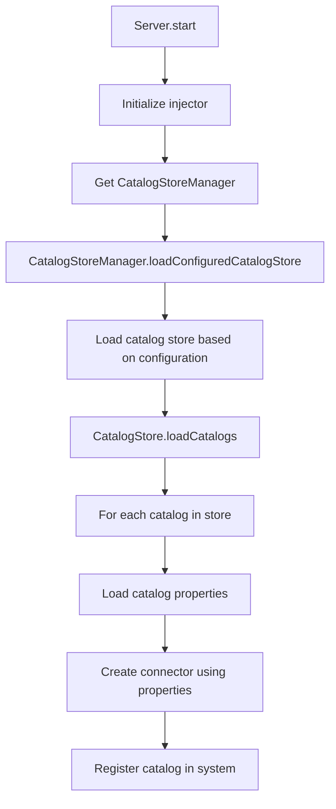
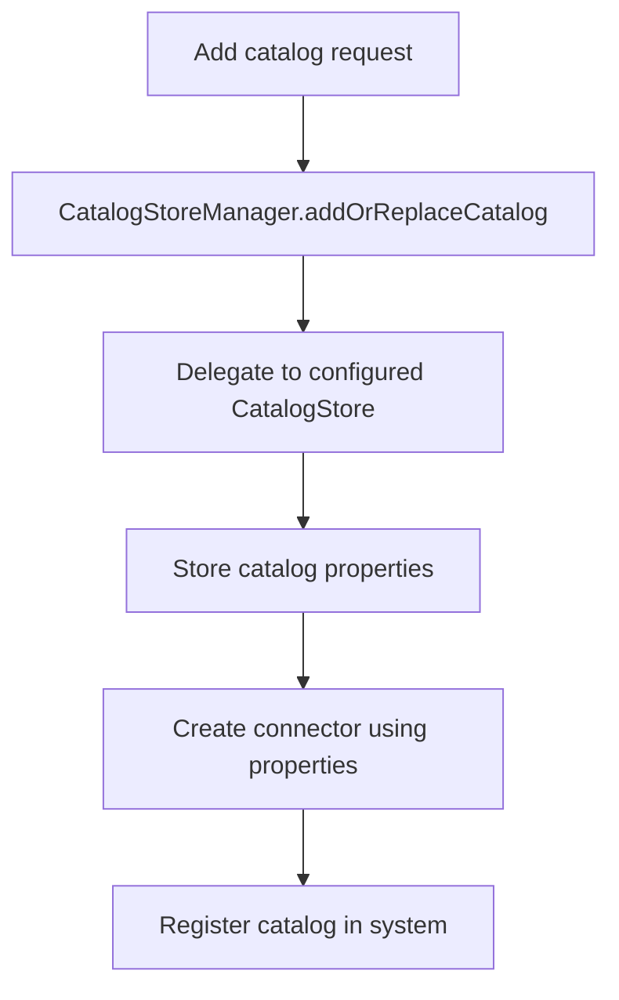
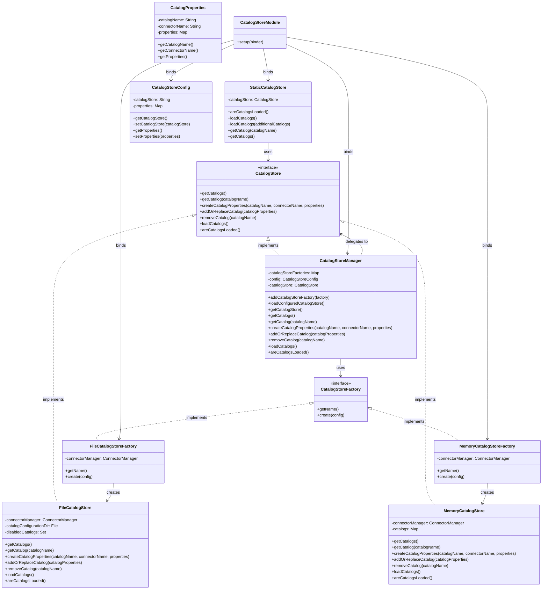

# Presto Catalog Store Design

## Overview

The Catalog Store system in Presto is responsible for managing catalog configurations. Catalogs in Presto are connectors to external data sources like Hive, MySQL, PostgreSQL, etc. The Catalog Store system provides a flexible and extensible way to store and retrieve catalog configurations from different storage backends.

This document describes the design of the Catalog Store system, including its components, flow, and configuration options.

## Architecture

The Catalog Store system is designed with a Service Provider Interface (SPI) pattern, allowing different storage backends to be plugged in. The system consists of the following key components:

### SPI Interfaces

1. **CatalogStore**: The main interface for catalog storage backends. It defines methods for storing and retrieving catalog configurations.
2. **CatalogProperties**: A class representing catalog properties.
3. **CatalogStoreFactory**: An interface for creating CatalogStore instances.

### Implementations

1. **FileCatalogStore**: Stores catalogs in files in the `etc/catalog/` directory.
2. **MemoryCatalogStore**: Stores catalogs in memory.
3. **CatalogStoreManager**: Manages different CatalogStore implementations and delegates operations to the configured store.
4. **StaticCatalogStore**: A wrapper around the CatalogStore interface for backward compatibility.

### Factory Implementations

1. **FileCatalogStoreFactory**: Creates FileCatalogStore instances.
2. **MemoryCatalogStoreFactory**: Creates MemoryCatalogStore instances.

### Configuration

1. **CatalogStoreConfig**: Configuration for the catalog store.
2. **CatalogStoreModule**: Guice module to bind all catalog store components.

## Flow Diagrams

### Catalog Loading Process



### Dynamic Catalog Addition



## Class Relationships



## Configuration Options

### Catalog Store Type

The type of catalog store to use can be configured with the `catalog.store` property:

```properties
catalog.store=file
```

Available options:
- `file`: Stores catalogs in files (default)
- `memory`: Stores catalogs in memory

### File Catalog Store Configuration

When using the file catalog store, the following properties can be configured:

```properties
catalog.config-dir=etc/catalog/
catalog.disabled-catalogs=example,test
```

- `catalog.config-dir`: The directory containing catalog configuration files
- `catalog.disabled-catalogs`: A comma-separated list of catalogs to disable

### Memory Catalog Store Configuration

The memory catalog store doesn't require any additional configuration.

## Extending the System

To add a new catalog store implementation:

1. Implement the `CatalogStore` interface
2. Implement the `CatalogStoreFactory` interface
3. Register the factory with the `CatalogStoreManager`

Example for an etcd-based catalog store:

```java
public class EtcdCatalogStore implements CatalogStore {
    // Implementation
}

public class EtcdCatalogStoreFactory implements CatalogStoreFactory {
    @Override
    public String getName() {
        return "etcd";
    }
    
    @Override
    public CatalogStore create(Map<String, String> config) {
        // Create and return an EtcdCatalogStore instance
    }
}
```

Then register the factory:

```java
catalogStoreManager.addCatalogStoreFactory(new EtcdCatalogStoreFactory());
```

## Backward Compatibility

The `StaticCatalogStore` class provides backward compatibility with the previous catalog loading mechanism. It wraps the new `CatalogStore` interface and delegates operations to it.

## Conclusion

The Catalog Store system provides a flexible and extensible way to manage catalog configurations in Presto. By using the SPI pattern, it allows different storage backends to be plugged in, making it easy to adapt to different deployment environments and requirements.