# Trino Catalog Management Design

## Source Code References

This document references the following key source files in the Trino GitHub repository:

- [Server](https://github.com/trinodb/trino/blob/master/core/trino-main/src/main/java/io/trino/server/Server.java) - Main server class that initializes the catalog loading process
- [CatalogStoreManager.java](https://github.com/trinodb/trino/blob/master/core/trino-main/src/main/java/io/trino/connector/CatalogStoreManager.java) - Manages catalog store implementations
- [CoordinatorDynamicCatalogManager.java](https://github.com/trinodb/trino/blob/master/core/trino-main/src/main/java/io/trino/connector/CoordinatorDynamicCatalogManager.java) - Dynamic catalog management on coordinator
- [StaticCatalogManager.java](https://github.com/trinodb/trino/blob/master/core/trino-main/src/main/java/io/trino/connector/StaticCatalogManager.java) - Static catalog management
- [CatalogStore.java](https://github.com/trinodb/trino/blob/master/core/trino-spi/src/main/java/io/trino/spi/catalog/CatalogStore.java) - SPI interface for catalog stores

## Overview

Trino's catalog management system is responsible for loading, managing, and providing access to catalogs. Catalogs in Trino are connectors to external data sources like Hive, MySQL, PostgreSQL, etc. The catalog management system is a critical component of Trino as it provides the foundation for accessing data from various sources.

## Catalog Loading Process (both coordinator and worker)

When a Trino coordinator starts, it loads catalogs through the following process:

1. The [`Server`](https://github.com/trinodb/trino/blob/master/core/trino-main/src/main/java/io/trino/server/Server.java) initializes the system and obtains a reference to the `CatalogStoreManager`
2. The [`CatalogStoreManager`](https://github.com/trinodb/trino/blob/master/core/trino-main/src/main/java/io/trino/connector/CatalogStoreManager.java) loads the configured catalog store
3. The [`ConnectorServicesProvider`](https://github.com/trinodb/trino/blob/master/core/trino-main/src/main/java/io/trino/connector/ConnectorServicesProvider.java) loads the initial catalogs from the catalog store
4. Each catalog is created using the [`CatalogFactory`](https://github.com/trinodb/trino/blob/master/core/trino-main/src/main/java/io/trino/connector/CatalogFactory.java) and registered in the system

### Flow Chart of Catalog Loading Process

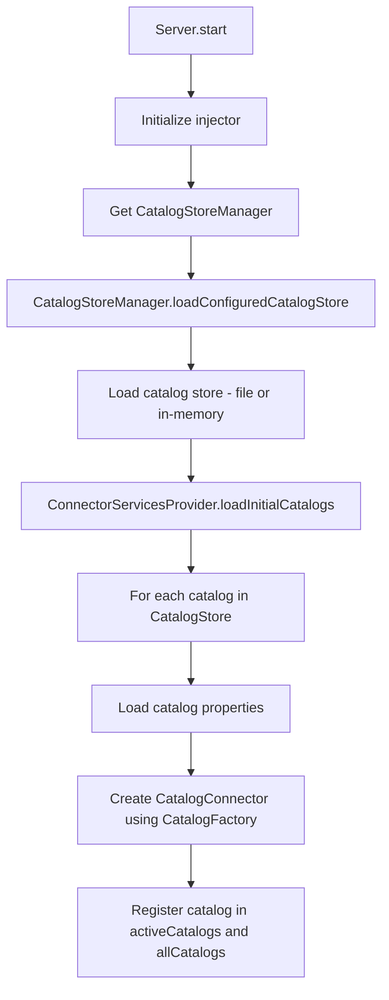

## Types of Catalog Management

Trino supports two types of catalog management:

1. **Static Catalog Management**: Catalogs are defined in configuration files in the `etc/catalog/` directory and loaded at startup. This is the default mode.

2. **Dynamic Catalog Management**: Catalogs can be created, modified, and dropped at runtime through SQL commands. This requires setting `catalog.management=dynamic` in the configuration.

## Catalog Loading in Coordinator vs Worker

Trino has different catalog management implementations for coordinator and worker nodes, depending on the configuration mode (static or dynamic).

### Static Catalog Management

In static catalog management mode (the default), catalogs are defined in configuration files in the `etc/catalog/` directory and loaded at startup.

#### Static Catalog Loading (both coordinator and worker)

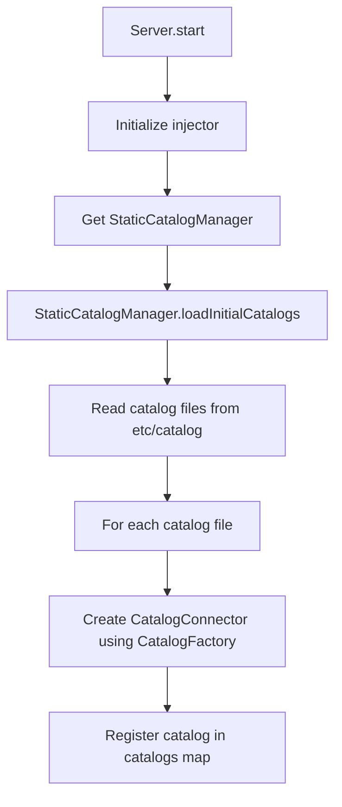

#### Worker Static Catalog Loading

Workers also use `StaticCatalogManager` in static mode and follow a similar process to load catalogs at startup.

### Dynamic Catalog Management

In dynamic catalog management mode (enabled with `catalog.management=dynamic`), catalogs can be created, modified, and dropped at runtime.

#### Coordinator Dynamic Catalog Loading

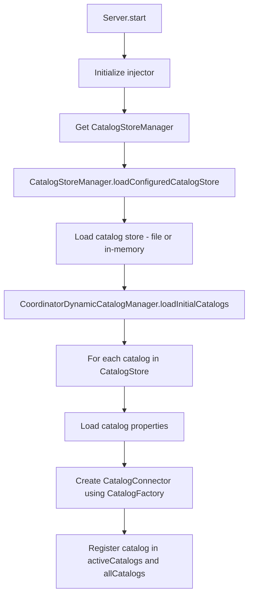

#### Worker Dynamic Catalog Loading

In dynamic mode, workers use `WorkerDynamicCatalogManager` which implements only `ConnectorServicesProvider` (not `CatalogManager`). Workers load catalogs on-demand when needed for query execution:

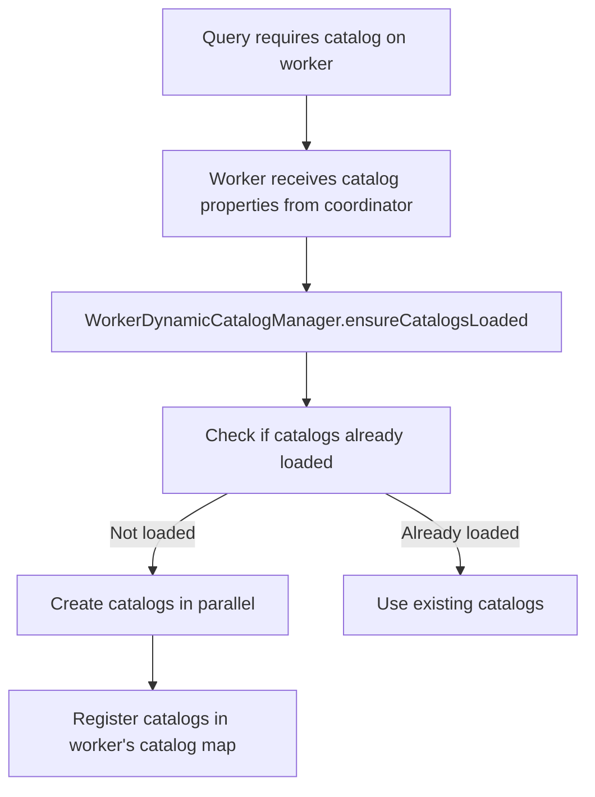

The key differences in worker dynamic catalog management are:

1. Workers load catalogs through the `ensureCatalogsLoaded()` method when a query requires them, with static catalog loading, it will throw exception when catalog is missing
2. Catalog properties are passed from the coordinator to workers as part of query execution in [PlanFragmenter](https://github.com/trinodb/trino/blob/048cf19f69ea85ff42e8e8ebd98d535a03e80ce6/core/trino-main/src/main/java/io/trino/sql/planner/PlanFragmenter.java#L147)

This lazy loading approach in dynamic mode ensures that workers only load the catalogs they need for query execution, which improves efficiency in large clusters with many catalogs.

## Key Components

### CatalogStore

The [`CatalogStore`](https://github.com/trinodb/trino/blob/master/core/trino-spi/src/main/java/io/trino/spi/catalog/CatalogStore.java) is an SPI interface that defines methods for storing and retrieving catalog configurations. It has the following key methods:

- `getCatalogs()`: Returns all stored catalogs
- `createCatalogProperties()`: Creates catalog properties from raw properties
- `addOrReplaceCatalog()`: Adds or replaces a catalog in the store
- `removeCatalog()`: Removes a catalog from the store

Implementations include:
- [`FileCatalogStore`](https://github.com/trinodb/trino/blob/master/core/trino-main/src/main/java/io/trino/connector/FileCatalogStore.java): Stores catalogs in files in the `etc/catalog/` directory
- [`InMemoryCatalogStore`](https://github.com/trinodb/trino/blob/master/core/trino-main/src/main/java/io/trino/connector/InMemoryCatalogStore.java): Stores catalogs in memory (used for dynamic catalog management)

### CatalogStoreManager

The [`CatalogStoreManager`](https://github.com/trinodb/trino/blob/master/core/trino-main/src/main/java/io/trino/connector/CatalogStoreManager.java) is responsible for managing the `CatalogStore` implementation. It:

1. Registers `CatalogStoreFactory` implementations
2. Loads the configured catalog store based on the `catalog.store` configuration
3. Delegates catalog operations to the underlying catalog store

### CatalogManager

The [`CatalogManager`](https://github.com/trinodb/trino/blob/master/core/trino-main/src/main/java/io/trino/metadata/CatalogManager.java) interface defines methods for managing catalogs:

- `getCatalogNames()`: Returns all catalog names
- `getCatalog()`: Returns a catalog by name
- `getActiveCatalogs()`: Returns all active catalogs
- `createCatalog()`: Creates a new catalog
- `dropCatalog()`: Drops a catalog

Implementations include:
- [`StaticCatalogManager`](https://github.com/trinodb/trino/blob/master/core/trino-main/src/main/java/io/trino/connector/StaticCatalogManager.java): For static catalog management
- [`CoordinatorDynamicCatalogManager`](https://github.com/trinodb/trino/blob/master/core/trino-main/src/main/java/io/trino/connector/CoordinatorDynamicCatalogManager.java): For dynamic catalog management on the coordinator

### ConnectorServicesProvider

The [`ConnectorServicesProvider`](https://github.com/trinodb/trino/blob/master/core/trino-main/src/main/java/io/trino/connector/ConnectorServicesProvider.java) interface defines methods for providing connector services:

- `loadInitialCatalogs()`: Loads initial catalogs at startup
- `ensureCatalogsLoaded()`: Ensures catalogs are loaded
- `pruneCatalogs()`: Removes unused catalogs
- `getConnectorServices()`: Returns connector services for a catalog

Implementations include:
- [`StaticCatalogManager`](https://github.com/trinodb/trino/blob/master/core/trino-main/src/main/java/io/trino/connector/StaticCatalogManager.java): For static catalog management
- [`CoordinatorDynamicCatalogManager`](https://github.com/trinodb/trino/blob/master/core/trino-main/src/main/java/io/trino/connector/CoordinatorDynamicCatalogManager.java): For dynamic catalog management on the coordinator
- [`WorkerDynamicCatalogManager`](https://github.com/trinodb/trino/blob/master/core/trino-main/src/main/java/io/trino/connector/WorkerDynamicCatalogManager.java): For dynamic catalog management on workers

## SPI Interfaces

The following SPI interfaces are related to catalog management:

1. [`CatalogStore`](https://github.com/trinodb/trino/blob/master/core/trino-spi/src/main/java/io/trino/spi/catalog/CatalogStore.java): Interface for storing and retrieving catalog configurations
2. [`CatalogStoreFactory`](https://github.com/trinodb/trino/blob/master/core/trino-spi/src/main/java/io/trino/spi/catalog/CatalogStoreFactory.java): Factory for creating `CatalogStore` instances
3. [`CatalogName`](https://github.com/trinodb/trino/blob/master/core/trino-spi/src/main/java/io/trino/spi/catalog/CatalogName.java): Represents a catalog name
4. [`CatalogProperties`](https://github.com/trinodb/trino/blob/master/core/trino-spi/src/main/java/io/trino/spi/catalog/CatalogProperties.java): Represents catalog properties
5. [`CatalogVersion`](https://github.com/trinodb/trino/blob/master/core/trino-spi/src/main/java/io/trino/spi/connector/CatalogVersion.java): Represents a catalog version

## Class Relationships

The main classes and their relationships are:

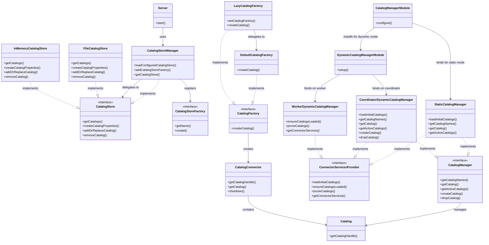

The diagram above shows the key classes and interfaces in Trino's catalog management system and their relationships:

- `Server` uses `CatalogStoreManager` to load the catalog store
- `CatalogStoreManager` implements `CatalogStore` and delegates to the configured store
- `CatalogManager` and `ConnectorServicesProvider` are implemented by the same class (`StaticCatalogManager` or `CoordinatorDynamicCatalogManager`) on coordinators
- `WorkerDynamicCatalogManager` implements only `ConnectorServicesProvider` on workers in dynamic mode
- `DynamicCatalogManagerModule` binds different implementations based on whether the node is a coordinator or worker
- `CatalogFactory` creates `CatalogConnector` instances
- `CatalogConnector` contains a `Catalog` and connector services
- `Catalog` represents a catalog in the system

## Dynamic Catalog Add Process

In dynamic catalog management mode, catalogs can be added at runtime through SQL commands. The process involves several components working together to create and register the new catalog.

### Flow Chart of Dynamic Catalog Add Process

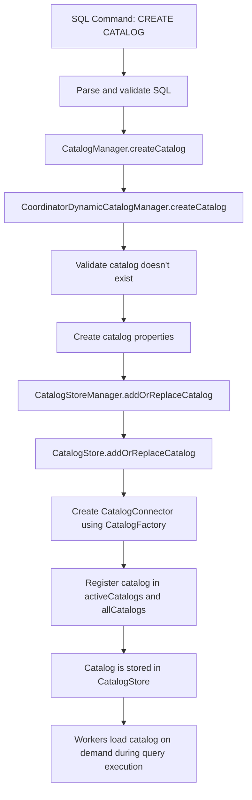

The dynamic catalog add process follows these steps:

1. A user executes a `CREATE CATALOG` SQL command
2. The SQL statement is parsed and validated
3. The `CatalogManager.createCatalog()` method is called
4. The request is delegated to `CoordinatorDynamicCatalogManager.createCatalog()`:
```java
   @Override
   public void createCatalog(CatalogName catalogName, ConnectorName connectorName, Map<String, String> properties, boolean notExists)
   {
       requireNonNull(catalogName, "catalogName is null");
       requireNonNull(connectorName, "connectorName is null");
       requireNonNull(properties, "properties is null");
|
       catalogsUpdateLock.lock();
       try {
           checkState(state != State.STOPPED, "ConnectorManager is stopped");
|
           if (activeCatalogs.containsKey(catalogName)) {
               if (!notExists) {
                   throw new TrinoException(ALREADY_EXISTS, format("Catalog '%s' already exists", catalogName));
               }
               return;
           }
|
           CatalogProperties catalogProperties = catalogStore.createCatalogProperties(catalogName, connectorName, properties);
|
           // get or create catalog for the handle
           CatalogConnector catalog = allCatalogs.computeIfAbsent(
                   createRootCatalogHandle(catalogName, catalogProperties.version()),
                   _ -> catalogFactory.createCatalog(catalogProperties));
           catalogStore.addOrReplaceCatalog(catalogProperties);
           activeCatalogs.put(catalogName, catalog.getCatalog());
|
           log.debug("Added catalog: %s", catalog.getCatalogHandle());
       }
       finally {
           catalogsUpdateLock.unlock();
       }
   }
```
5. The system validates that the catalog doesn't already exist
6. Catalog properties are created from the SQL command parameters
7. `CatalogStoreManager.addOrReplaceCatalog()` is called to add the catalog to the store
8. The catalog store persists the catalog configuration
9. A `CatalogConnector` is created using the `CatalogFactory`
10. The catalog is registered in the `activeCatalogs` and `allCatalogs` maps
11. The catalog is stored in the `CatalogStore` for persistence
12. Workers will load the catalog on demand during query execution when needed

### Key Interfaces and Classes for Catalog Addition

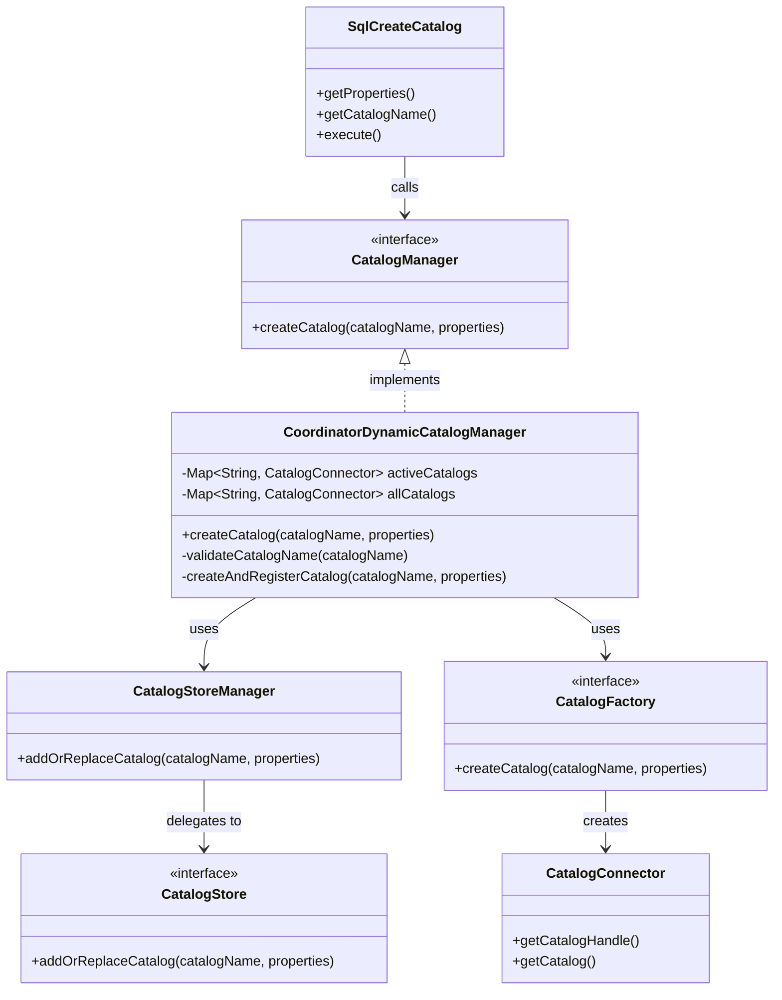

## Dynamic Catalog Drop Process

In dynamic catalog management mode, catalogs can be dropped at runtime through SQL commands. The process involves removing the catalog from both the catalog store and the runtime system.

### Flow Chart of Dynamic Catalog Drop Process

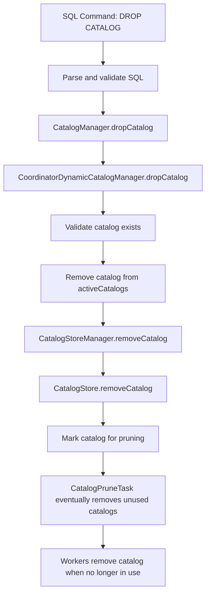

The dynamic catalog drop process follows these steps:

1. A user executes a `DROP CATALOG` SQL command
2. The SQL statement is parsed and validated
3. The `CatalogManager.dropCatalog()` method is called
4. The request is delegated to `CoordinatorDynamicCatalogManager.dropCatalog()`:
```java
   @Override
   public void dropCatalog(CatalogName catalogName, boolean exists)
   {
       requireNonNull(catalogName, "catalogName is null");
|
       boolean removed;
       catalogsUpdateLock.lock();
       try {
           checkState(state != State.STOPPED, "ConnectorManager is stopped");
|
           catalogStore.removeCatalog(catalogName);
           removed = activeCatalogs.remove(catalogName) != null;
       }
       finally {
           catalogsUpdateLock.unlock();
       }
|
       if (!removed && !exists) {
           throw new TrinoException(CATALOG_NOT_FOUND, format("Catalog '%s' not found", catalogName));
       }
       // Do not shut down the catalog, because there may still be running queries using this catalog.
       // Catalog shutdown logic will be added later.
   }
```
5. The system validates that the catalog exists
6. The catalog is removed from the `activeCatalogs` map
7. `CatalogStoreManager.removeCatalog()` is called to remove the catalog from the store
8. The catalog store removes the catalog configuration
9. The catalog is marked for pruning but not immediately shut down (to support running queries)
10. The `CatalogPruneTask` periodically removes catalogs that are no longer in use
11. Workers remove the catalog from their maps when it's no longer needed for any query

### Key Interfaces and Classes for Catalog Removal

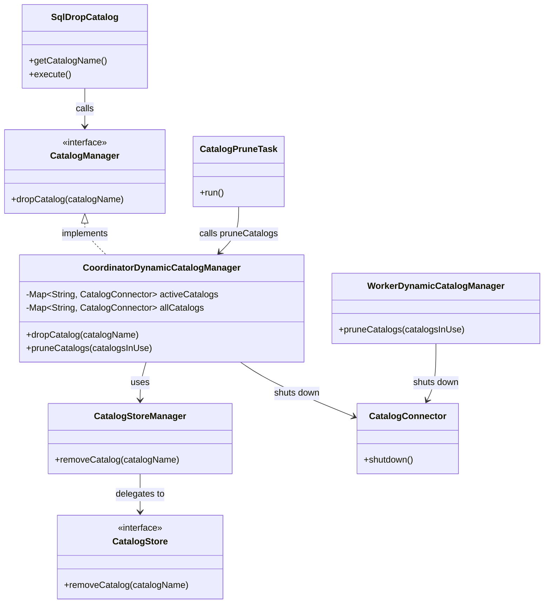

## Catalog Propagation During Query Execution

When a query is executed in Trino with dynamic catalog management, the coordinator needs to ensure that workers have access to all necessary catalogs. This is handled by the `PlanFragmenter` class, which includes catalog information in the plan fragments sent to workers.

### Flow Chart of Catalog Propagation Process

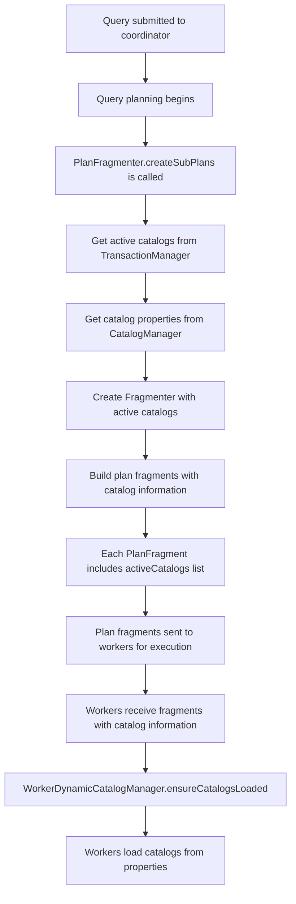

The catalog propagation process follows these steps:

1. When a query is submitted to the coordinator, the query planning process begins
2. During query planning, `PlanFragmenter.createSubPlans()` is called to split the logical plan into fragments
3. The `PlanFragmenter` gets the list of active catalogs from the `TransactionManager`:
```java
   List<CatalogProperties> activeCatalogs = transactionManager.getActiveCatalogs(session.getTransactionId().orElseThrow()).stream()
           .map(CatalogInfo::catalogHandle)
           .flatMap(catalogHandle -> catalogManager.getCatalogProperties(catalogHandle).stream())
           .collect(toImmutableList());
```
4. This list includes all catalogs that are active in the current transaction
5. The `PlanFragmenter` creates a `Fragmenter` instance with the active catalogs list
6. When building plan fragments, the active catalogs are included in each fragment:
```java
   PlanFragment fragment = new PlanFragment(
           fragmentId,
           root,
           dependencies,
           properties.getPartitioningHandle(),
           properties.getPartitionCount(),
           schedulingOrder,
           properties.getPartitioningScheme(),
           OptionalInt.empty(),
           statsAndCosts.getForSubplan(root),
           activeCatalogs,  // Catalog properties are included here
           languageFunctions,
           Optional.of(jsonFragmentPlan(root, metadata, functionManager, session)));
```
7. The plan fragments, including the catalog information, are sent to workers for execution
8. When workers receive the fragments, they extract the catalog properties
9. Workers call `WorkerDynamicCatalogManager.ensureCatalogsLoaded()` with the catalog properties
10. Workers load any catalogs that aren't already loaded, using the provided properties

This mechanism ensures that all workers have access to the necessary catalogs for query execution, without requiring a separate catalog broadcasting system. Catalogs are propagated as part of the normal query execution flow.

### Key Classes for Catalog Propagation

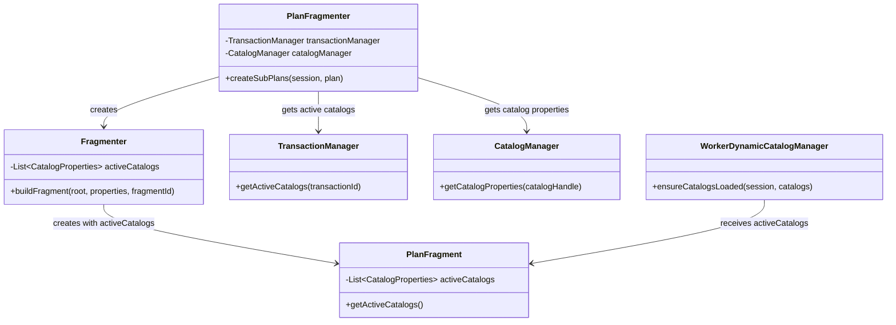

## Catalog Pruning Process

In dynamic catalog management mode, catalogs that are no longer in use need to be cleaned up to free resources. This is handled by the `CatalogPruneTask`, which periodically checks for unused catalogs and removes them from both the coordinator and worker nodes.

### Flow Chart of Catalog Pruning Process

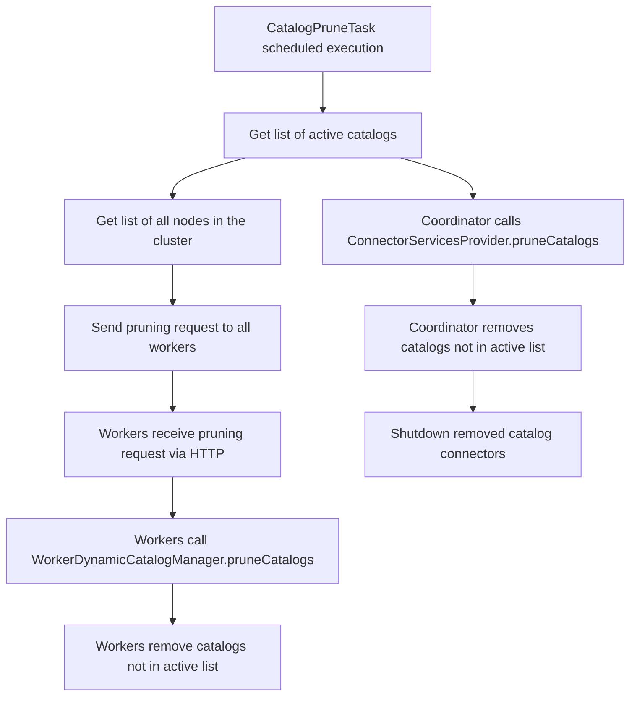

The catalog pruning process follows these steps:

1. The `CatalogPruneTask` is scheduled to run periodically (configured by `catalog.prune-task.update-interval`):
```java
   @PostConstruct
   public void start()
   {
       if (enabled && !started.getAndSet(true)) {
           executor.scheduleWithFixedDelay(() -> {
               try {
                   pruneWorkerCatalogs();
               }
               catch (Throwable e) {
                   // ignore to avoid getting unscheduled
                   log.warn(e, "Error pruning catalogs");
               }
           }, updateInterval.toMillis(), updateInterval.toMillis(), MILLISECONDS);
       }
   }
```
2. It collects a list of active catalogs from two sources:
```java
   private List<CatalogHandle> getActiveCatalogs()
   {
       ImmutableSet.Builder<CatalogHandle> activeCatalogs = ImmutableSet.builder();
       // all catalogs in an active transaction
       transactionManager.getAllTransactionInfos().forEach(info -> activeCatalogs.addAll(info.getActiveCatalogs()));
       // all catalogs currently associated with a name
       activeCatalogs.addAll(catalogManager.getActiveCatalogs());
       return ImmutableList.copyOf(activeCatalogs.build());
   }
```
3. It gets a list of all nodes in the cluster from the `InternalNodeManager`:
```java
   AllNodes allNodes = internalNodeManager.getAllNodes();
   Set<URI> online = Stream.of(allNodes.activeNodes(), allNodes.inactiveNodes(), allNodes.drainingNodes(), allNodes.drainedNodes(), allNodes.shuttingDownNodes())
           .flatMap(Set::stream)
           .map(InternalNode::getInternalUri)
           .filter(uri -> !uri.equals(currentNode.getInternalUri()))
           .collect(toImmutableSet());
```
4. It sends an HTTP request to each worker node with the list of active catalogs:
```java
   for (URI uri : online) {
       uri = uriBuilderFrom(uri).appendPath("/v1/task/pruneCatalogs").build();
       Request request = preparePost()
               .setUri(uri)
               .addHeader(CONTENT_TYPE, JSON_UTF_8.toString())
               .setBodyGenerator(jsonBodyGenerator(CATALOG_HANDLES_CODEC, activeCatalogs))
               .build();
       httpClient.executeAsync(request, new ResponseHandler<>() {...});
   }
```
5. Workers receive the request and call `WorkerDynamicCatalogManager.pruneCatalogs()`:
```java
   @Override
   public void pruneCatalogs(Set<CatalogHandle> catalogsInUse)
   {
       List<CatalogConnector> removedCatalogs = new ArrayList<>();
       catalogRemovingLock.lock();
       try {
           if (stopped) {
               return;
           }
           Iterator<Entry<CatalogHandle, CatalogConnector>> iterator = catalogs.entrySet().iterator();
           while (iterator.hasNext()) {
               Entry<CatalogHandle, CatalogConnector> entry = iterator.next();
               if (!catalogsInUse.contains(entry.getKey())) {
                   iterator.remove();
                   removedCatalogs.add(entry.getValue());
               }
           }
       }
       finally {
           catalogRemovingLock.unlock();
       }
|
       removedCatalogs.forEach(removedCatalog -> Futures.submit(
               () -> {
                   try {
                       removedCatalog.shutdown();
                       log.debug("Pruned catalog: %s", removedCatalog.getCatalogHandle());
                   }
                   catch (Throwable e) {
                       log.error(e, "Error shutting down catalog: %s".formatted(removedCatalog));
                   }
               },
               executor).state());
   }
```
6. Workers remove catalogs that are not in the active list and shut them down
7. The coordinator also calls `ConnectorServicesProvider.pruneCatalogs()` to clean up its own catalogs:
```java
   // prune all inactive catalogs - we pass an empty set here because manager always retains active catalogs
   connectorServicesProvider.pruneCatalogs(ImmutableSet.of());
```
8. Removed catalogs are shut down gracefully to free resources

This process ensures that catalogs are kept alive as long as they are needed for active queries, but are eventually cleaned up when no longer in use.

### Key Interfaces and Classes for Catalog Pruning

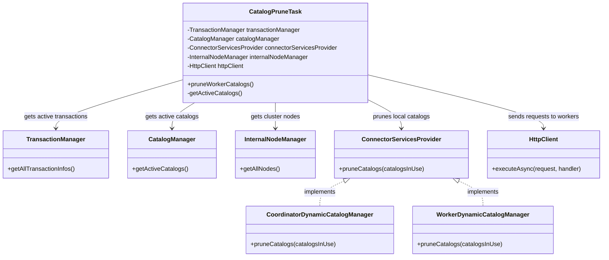

## Conclusion

Trino's catalog management system provides a flexible and extensible way to manage catalogs. It supports both static and dynamic catalog management, allowing users to choose the approach that best fits their needs. The system is designed to be extensible, allowing for custom implementations of catalog stores and factories.